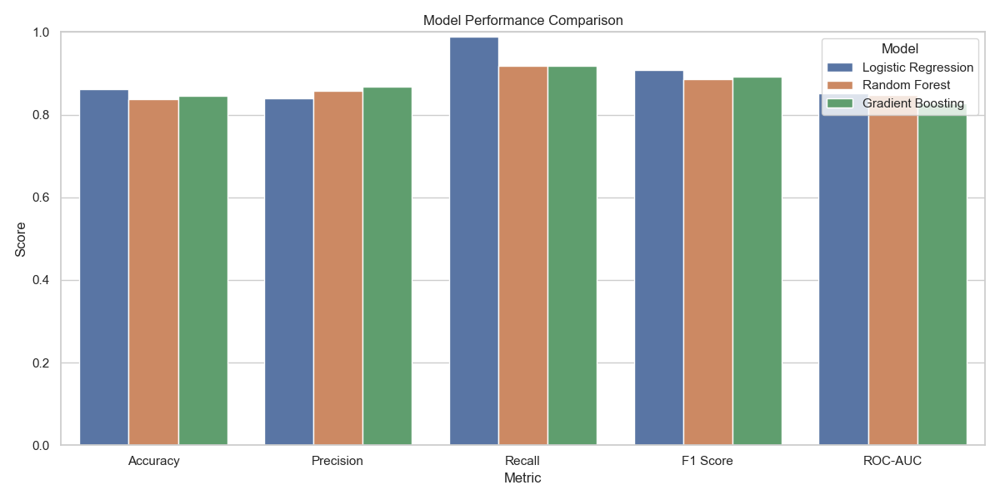
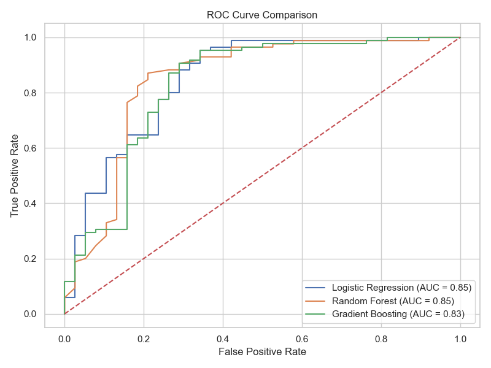
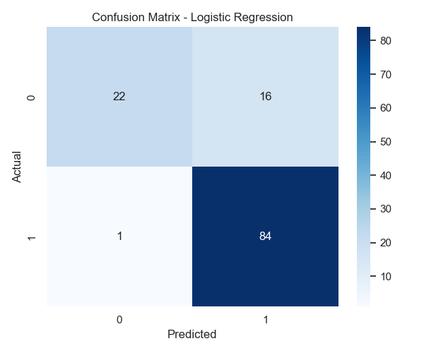
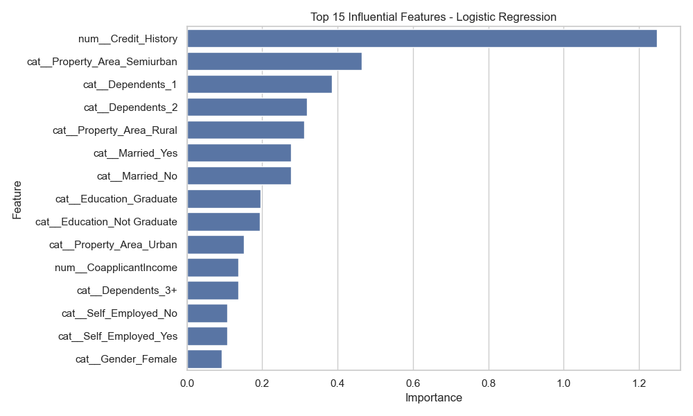

# 💰 Loan Approval Prediction System
This project implements a complete end-to-end machine learning pipeline with model deployment and user interface integration.
A Machine Learning-based system to predict loan approval using FastAPI backend and Streamlit frontend, with Docker support.
## 📌 Overview
This project predicts whether a loan application will be approved or rejected using Machine Learning. It uses applicant details like income, credit history, and loan amount to make accurate predictions.

---

## 🚀 Features
- Data preprocessing & cleaning  
- Feature engineering  
- Model training (Logistic Regression, Random Forest, Gradient Boosting)  
- Model comparison & evaluation  
- Visualization of results  
- FastAPI-based prediction API  
- Interactive Streamlit frontend  
- Docker deployment  

---

## 🛠️ Technologies Used
- Python  
- Pandas, NumPy  
- Scikit-learn  
- Matplotlib, Seaborn  
- FastAPI  
- Streamlit  
- Docker  

 ---


## Run Backend
python -m uvicorn app.main:app --reload


## Run Frontend
streamlit run frontend.py

---

## 🐳 Docker Setup

Build image:
docker build -t loan-api .

Run container:
docker run -p 8000:8000 loan-api

---

## 🖥️ UI Preview

### Input Form


### Prediction Result


## 📊 Results
The following visualizations show model performance and evaluation metrics.

## 📊 Results

### Model Comparison


### ROC Curve


### Confusion Matrix (Best Model)


### Feature Importance


The following visualizations demonstrate the performance and effectiveness of the trained machine learning models.

## 🔌 API Endpoint

### Endpoint: POST /predict
Input: applicant details  
Output: Approved / Rejected

---

## 🚀 Demo
- FastAPI Docs: http://127.0.0.1:8000/docs  
- Frontend UI: http://localhost:8501

## 🧪 Experiment Tracking

Model experiments were tracked by recording performance metrics such as Accuracy and F1-score.  
Different models were compared, and the best-performing model was selected based on evaluation results.

## 🌐 Deployment

The application is deployed locally using FastAPI and Docker.  
It can be easily deployed on cloud platforms like Render or AWS.

## 🌐 Live Deployment

API: https://loan-approval-prediction-system-1-glro.onrender.com  
Docs: https://loan-approval-prediction-system-1-glro.onrender.com/docs

## 🌟 Highlights

✔ End-to-end ML pipeline  
✔ Real-time prediction API  
✔ Interactive user interface  
✔ Docker-based deployment  

## 👤 Author
**Kruthika S**  
🔗 GitHub: https://github.com/kruthikasrinivasa

## ⚙️ How to Run Locally

### 1️⃣ Install dependencies
```bash
pip install -r requirements.txt


